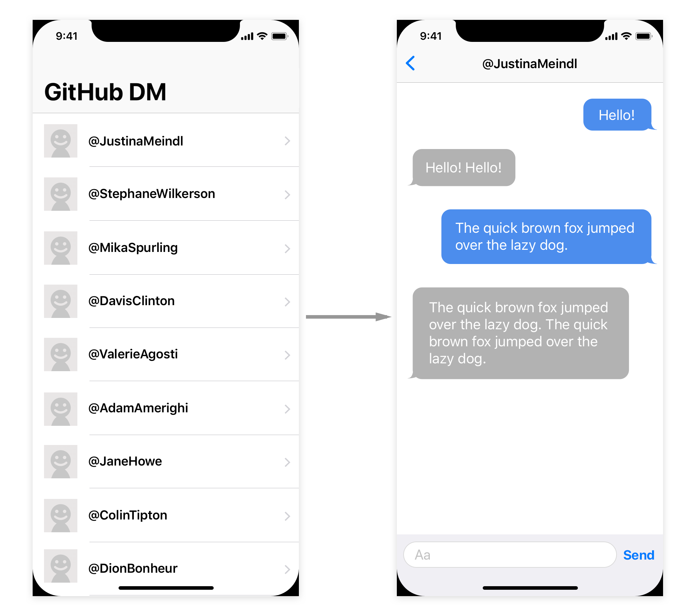

# お題「GitHubのDirect Messageアプリを作る」

あなたが特定の状況にいると想定して、GitHub上でDirect Messageが別の開発者と送り合える架空のアプリを実装します。

# 想定
* 想定する状況として以下のAまたはBを選択してください
* どちらの状況を選択したか README.md に書いてください ( README.md は自由に記入可)
* AとBの選択自体は課題の評価に影響しません

## A. 新人エンジニアを指導する

経験の浅いiOSエンジニアがあなたのチームに入ってきました。このエンジニアを指導するため、できるだけシンプルな構成でサンプルアプリを実装して見せることにしました。

## B. 長期開発されるアプリを設計して実装する

あなたは計5名のiOSチームのリーダーです。このチームでiOSアプリを新規開発します。このプロジェクトは、チームで長期に渡って開発とメンテナンスが行われる見込みです。チームで開発する前に、あなたはリーダーとしてアプリの設計を行い、基礎部分を実装することになりました。

# 最低限の仕様

* 最初の画面にはAPIから任意のユーザーを取得し表示する
  * 表示項目はスクリーンネームとプロフィール画像とする
  * APIは[GET users](https://developer.github.com/v3/users/#get-all-users)を利用する
    * このAPIは認証なしでリクエストすることができるが、[rate limit が存在する](https://developer.github.com/v3/#rate-limiting)ため、その場合のエラー処理を実装する
* あるユーザーをタップするとメッセージ画面に遷移する
* メッセージ画面ではそのユーザーとメッセージを送り合うことができる
  * ただしここではGitHubのAPIは叩かず、ダミー実装でアプリ内で送り合っているように見せる ○ あるメッセージを送信すると1秒後にそのメッセージを2回繰り返した返事が返ってくるようにする (例: “Hi.” に対して “Hi. Hi.” と返事)
* 最低限実装すべき画面は「最低限の画面仕様」を参照

# 追加で実装された場合に評価の対象になる仕様
* よりユーザーにとって使いやすい動作にする
* メッセージの送信履歴を永続化する
* その他の機能や動作を実装する

# 最低限の画面仕様



# 条件

* Mac App Storeで入手できる最新のXcodeを使用する
* 実装言語
  * SwiftまたはObjective-C
    * Objective-Cを選択した場合でも、面接時にSwiftについての質問をする場合があります
  * 言語のバージョンは上記Xcodeで使用可能な最新のもの
* Deployment Targetは最新のiOSバージョンにする
* 外部ライブラリを使用しない
  * iOS SDKだけで作成する
* 吹き出しの背景画像は同梱の `left_bubble.png` と `right_bubble.png` を使う

# 提出物

* Xcodeでビルドするだけで動くようにプロジェクトまたはワークスペースを構成する
* そのプロジェクトまたはワークスペースと README.md を含むディレクトリをまとめてmasterブランチにコミットする

---

# 技術課題に必要なデータです

```
resources
├── left_bubble.png
├── left_bubble@2x.png
├── left_bubble@3x.png
├── right_bubble.png
├── right_bubble@2x.png
└── right_bubble@3x.png

0 directories, 6 files
```
