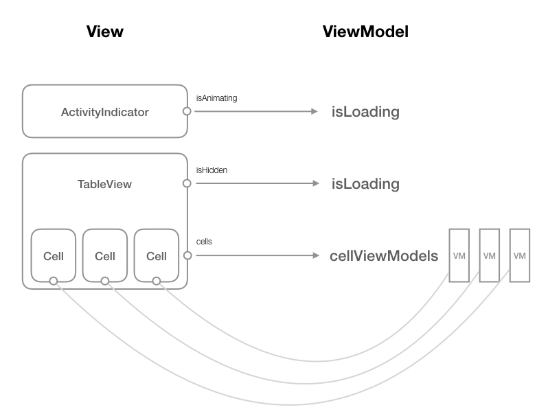

# GithubChat

A chat app for GitHub users. This app is a skeleton and optimized for a 5-people (could be more) team. 

## Feature

* Ready for real-time message services 
* Sent/Unsent UI 
* MVVM structure
* Replaceable mock services
* Production-ready protocols for Autolayout and UI events
* ArrayObservable for index-level notification of array data change

## Description 

Please check the Specification below for the functionalities of the app.

This project is structured by the MVVM:

 

All UI components are represented by a view model. UI state changes are transformed into model manipulation. It is good for separating the UI implementation from logic implementation. 

The service layer and the controller layer are also separated from the view controller. It means that:

1. Engineers could focus on only a single-function, small-scope module.
2. We can easily mock the data without the server support or even without knowing the response format.

**Here's the implementation guideline:**

If you:

* want to mock server response: **modify the domain service**
* want to implement the logic before the design is finished: **based-on given wireframes, design the view model and implement the controller only**
* Domain logic should be separated from the general logic (e.g network logic and Github logic should be in different places)
* Designing protocol for reducing duplication code (e.g HttpErrorHandlable) 

## Specification

Specification is natural language cases for implementation.

### User List 

**When the user is in the user list,**

The view should:

* fetch the user data from the server
* display loading indicator when the response from the server is not ready
* hide the list when loading

**Error cases:**

When the request limitation is reached: 

* display an alert with limitation reset time (if available)

Other server error:

* display an alert with brief debug message for customer services

 
**When the data is fetched,**

The view should :

* hide the loading indicator
* show the list

The cell of the list should:

* be able to be pressed
* transit user to chatroom page after a press

### Chatroom

**When the user is in the chatroom page**

The module should,

* Load the chatroom data from the server
* display the existed message if there's any
* listen to any message update from the other user

The view should,

* display an input field for inputting message 
* display a send button for sending the message

**When user press on the input field**

The view should,

* display a keyboard
* move the input view above the keyboard
* support press-to-dismiss-keyboard

The keyboard should, 

* support press-return-to-send feature

**When user send a message**

The module should,

* send the message to the server

The view should,

* display the to-be-sent message with semi-transparent background 
* reload the message to the intransparent background once the message is sent
* move the chatroom to the latest message

## Naming convention

The functions of source code are categorized based on the folder:

* Protocol: The globally defined protocol 
* Common: Common tools/UI components
* Helper: Extension for existed classes/structs 
* Model: Json decodable Data model 
* Service: Global service layer such as NetworkService or domain service such as GithubService  
* Module: The UI module
    * ViewController: View layer including the definition of the view model 
    * Controller: Controller layer 

